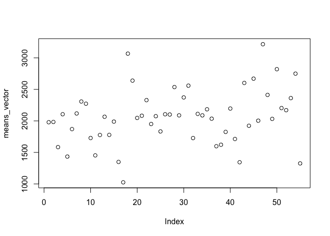
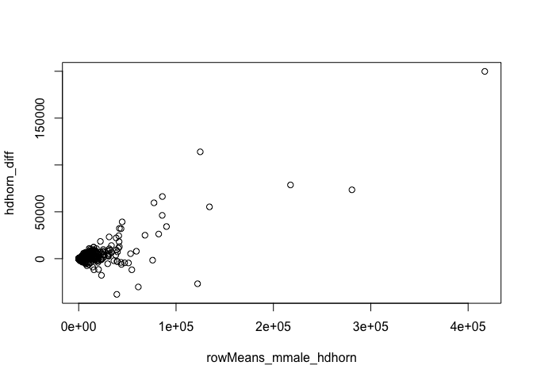

Question 2
----------

reading the csv file
====================

    rna_counts <- read.csv("eXpress_dm_counts.csv")
    str(rna_counts)

    ## 'data.frame':    4375 obs. of  56 variables:
    ##  $ X                     : Factor w/ 4375 levels "FBpp0070006",..: 1875 2750 1096 844 4253 2344 4251 1703 1172 4313 ...
    ##  $ F101_lg_female_hdhorn : int  32 1917 61 22 183 1695 1905 146 286 1096 ...
    ##  $ F101_lg_female_thxhorn: int  9 2064 80 300 153 1327 2685 466 276 1136 ...
    ##  $ F101_lg_female_wings  : int  14 1825 57 8 127 2495 654 123 164 777 ...
    ##  $ F105_lg_female_hdhorn : int  51 2660 77 15 188 3306 1959 263 386 1501 ...
    ##  $ F105_lg_female_thxhorn: int  9 411 50 164 168 2214 801 182 276 1027 ...
    ##  $ F105_lg_female_wings  : int  23 923 44 12 180 3198 1044 133 214 1158 ...
    ##  $ F131_lg_female_hdhorn : int  26 4777 45 12 122 1148 1767 123 335 1201 ...
    ##  $ F131_lg_female_thxhorn: int  17 2767 53 835 144 827 2426 752 532 1915 ...
    ##  $ F131_lg_female_wings  : int  14 7129 74 26 88 1847 1923 161 224 1106 ...
    ##  $ F135_sm_female_wings  : int  10 1440 43 2 132 2188 608 73 283 1121 ...
    ##  $ F135_sm_female_hdhorn : int  31 546 45 4 146 2447 680 115 228 887 ...
    ##  $ F135_sm_female_thxhorn: int  35 793 67 369 171 1406 1587 330 387 1496 ...
    ##  $ F136_sm_female_hdhorn : int  43 4523 48 26 108 1482 1523 121 264 1057 ...
    ##  $ F136_sm_female_thxhorn: int  16 4713 41 228 72 1463 1697 202 300 1123 ...
    ##  $ F136_sm_female_wings  : int  21 6102 55 31 87 2222 1799 233 310 1267 ...
    ##  $ F196_sm_female_hdhorn : int  9 32 45 225 101 361 2300 157 341 1224 ...
    ##  $ F196_sm_female_thxhorn: int  30 26 72 482 60 351 2456 324 357 1140 ...
    ##  $ F196_sm_female_wings  : int  11 86 237 77 175 822 2753 129 688 2876 ...
    ##  $ F197_sm_female_hdhorn : int  50 2887 104 610 229 1951 2563 186 496 1970 ...
    ##  $ F197_sm_female_thxhorn: int  19 2861 88 461 151 1564 1700 302 337 1350 ...
    ##  $ F197_sm_female_wings  : int  20 3542 96 4 132 2715 733 165 287 1036 ...
    ##  $ F218_lg_female_hdhorn : int  39 1542 82 148 390 866 2172 90 591 2345 ...
    ##  $ F218_lg_female_thxhorn: int  15 347 82 885 226 1041 2346 306 532 1883 ...
    ##  $ F218_lg_female_wings  : int  15 6718 71 8 179 1559 3304 90 301 1165 ...
    ##  $ M120_sm_male_genitalia: int  16 2031 81 111 128 409 2171 72 331 1357 ...
    ##  $ M120_sm_male_hdhorn   : int  41 3518 77 10 170 1096 1858 70 330 1220 ...
    ##  $ M120_sm_male_thxhorn  : int  59 540 109 775 165 597 2116 294 571 2081 ...
    ##  $ M120_sm_male_wings    : int  18 3752 89 30 140 937 2974 165 406 1648 ...
    ##  $ M125_lg_male_genitalia: int  22 3873 77 23 124 1096 749 215 289 1144 ...
    ##  $ M125_lg_male_hdhorn   : int  14 8273 48 5 67 1420 873 108 237 948 ...
    ##  $ M125_lg_male_wings    : int  7 8980 67 2 144 2885 1454 156 285 1219 ...
    ##  $ M160_lg_male_genitalia: int  27 433 92 23 122 323 1412 59 502 1933 ...
    ##  $ M160_lg_male_hdhorn   : int  27 2518 73 8 212 339 1586 68 470 1876 ...
    ##  $ M160_lg_male_thxhorn  : int  16 783 95 271 235 661 1347 175 596 2487 ...
    ##  $ M160_lg_male_wings    : int  5 3069 97 22 162 647 1957 143 501 1983 ...
    ##  $ M171_sm_male_genitalia: int  13 205 144 35 144 1145 1369 85 402 1466 ...
    ##  $ M171_sm_male_hdhorn   : int  69 2358 81 22 121 1513 811 115 264 1068 ...
    ##  $ M171_sm_male_thxhorn  : int  14 2120 60 269 166 1576 1089 251 261 940 ...
    ##  $ M171_sm_male_wings    : int  18 1157 56 21 131 3628 380 122 229 874 ...
    ##  $ M172_sm_male_genitalia: int  17 4184 188 42 115 1399 1104 103 488 1701 ...
    ##  $ M172_sm_male_hdhorn   : int  15 5356 78 7 70 1088 1638 174 169 804 ...
    ##  $ M172_sm_male_thxhorn  : int  13 3269 75 260 57 852 1373 264 229 854 ...
    ##  $ M172_sm_male_wings    : int  20 6755 140 42 108 2601 2168 294 390 1557 ...
    ##  $ M180_lg_male_genitalia: int  15 4739 64 86 107 1125 834 138 166 708 ...
    ##  $ M180_lg_male_hdhorn   : int  21 7039 47 6 125 1746 1066 115 183 821 ...
    ##  $ M180_lg_male_thxhorn  : int  9 5353 44 35 85 1483 1348 87 150 633 ...
    ##  $ M180_lg_male_wings    : int  25 13390 67 6 110 2381 886 110 228 1006 ...
    ##  $ M200_sm_male_genitalia: int  49 3338 95 102 171 1301 1886 451 496 1949 ...
    ##  $ M200_sm_male_hdhorn   : int  25 2021 51 51 115 1019 629 127 272 1093 ...
    ##  $ M200_sm_male_thxhorn  : int  40 7839 93 148 161 2383 3594 431 589 2352 ...
    ##  $ M200_sm_male_wings    : int  15 5683 74 9 103 2055 946 199 313 1232 ...
    ##  $ M257_lg_male_genitalia: int  30 2162 113 51 178 690 2092 46 463 1741 ...
    ##  $ M257_lg_male_hdhorn   : int  23 9060 96 6 176 1133 4062 43 349 1246 ...
    ##  $ M257_lg_male_thxhorn  : int  39 2290 130 197 257 984 2590 174 479 1917 ...
    ##  $ M257_lg_male_wings    : int  9 2861 57 28 99 718 1633 75 218 855 ...

checking for 0 values in rna\_counts

    #checking for values of 0 
    tail(which(rna_counts == 0, arr.ind=TRUE))

    ##          row col
    ## [2750,] 4003  56
    ## [2751,] 4043  56
    ## [2752,] 4052  56
    ## [2753,] 4073  56
    ## [2754,] 4116  56
    ## [2755,] 4261  56

    #replacing 0 values with 0.1 
    newrna_counts <- replace(rna_counts, rna_counts<1, 0.1)

    ## Warning in Ops.factor(left, right): '<' not meaningful for factors

    #checking for values of 0 after replacement
    which(newrna_counts == 0, arr.ind=TRUE)

    ##      row col

    #comparing the two data frames
    str(rna_counts)

    ## 'data.frame':    4375 obs. of  56 variables:
    ##  $ X                     : Factor w/ 4375 levels "FBpp0070006",..: 1875 2750 1096 844 4253 2344 4251 1703 1172 4313 ...
    ##  $ F101_lg_female_hdhorn : int  32 1917 61 22 183 1695 1905 146 286 1096 ...
    ##  $ F101_lg_female_thxhorn: int  9 2064 80 300 153 1327 2685 466 276 1136 ...
    ##  $ F101_lg_female_wings  : int  14 1825 57 8 127 2495 654 123 164 777 ...
    ##  $ F105_lg_female_hdhorn : int  51 2660 77 15 188 3306 1959 263 386 1501 ...
    ##  $ F105_lg_female_thxhorn: int  9 411 50 164 168 2214 801 182 276 1027 ...
    ##  $ F105_lg_female_wings  : int  23 923 44 12 180 3198 1044 133 214 1158 ...
    ##  $ F131_lg_female_hdhorn : int  26 4777 45 12 122 1148 1767 123 335 1201 ...
    ##  $ F131_lg_female_thxhorn: int  17 2767 53 835 144 827 2426 752 532 1915 ...
    ##  $ F131_lg_female_wings  : int  14 7129 74 26 88 1847 1923 161 224 1106 ...
    ##  $ F135_sm_female_wings  : int  10 1440 43 2 132 2188 608 73 283 1121 ...
    ##  $ F135_sm_female_hdhorn : int  31 546 45 4 146 2447 680 115 228 887 ...
    ##  $ F135_sm_female_thxhorn: int  35 793 67 369 171 1406 1587 330 387 1496 ...
    ##  $ F136_sm_female_hdhorn : int  43 4523 48 26 108 1482 1523 121 264 1057 ...
    ##  $ F136_sm_female_thxhorn: int  16 4713 41 228 72 1463 1697 202 300 1123 ...
    ##  $ F136_sm_female_wings  : int  21 6102 55 31 87 2222 1799 233 310 1267 ...
    ##  $ F196_sm_female_hdhorn : int  9 32 45 225 101 361 2300 157 341 1224 ...
    ##  $ F196_sm_female_thxhorn: int  30 26 72 482 60 351 2456 324 357 1140 ...
    ##  $ F196_sm_female_wings  : int  11 86 237 77 175 822 2753 129 688 2876 ...
    ##  $ F197_sm_female_hdhorn : int  50 2887 104 610 229 1951 2563 186 496 1970 ...
    ##  $ F197_sm_female_thxhorn: int  19 2861 88 461 151 1564 1700 302 337 1350 ...
    ##  $ F197_sm_female_wings  : int  20 3542 96 4 132 2715 733 165 287 1036 ...
    ##  $ F218_lg_female_hdhorn : int  39 1542 82 148 390 866 2172 90 591 2345 ...
    ##  $ F218_lg_female_thxhorn: int  15 347 82 885 226 1041 2346 306 532 1883 ...
    ##  $ F218_lg_female_wings  : int  15 6718 71 8 179 1559 3304 90 301 1165 ...
    ##  $ M120_sm_male_genitalia: int  16 2031 81 111 128 409 2171 72 331 1357 ...
    ##  $ M120_sm_male_hdhorn   : int  41 3518 77 10 170 1096 1858 70 330 1220 ...
    ##  $ M120_sm_male_thxhorn  : int  59 540 109 775 165 597 2116 294 571 2081 ...
    ##  $ M120_sm_male_wings    : int  18 3752 89 30 140 937 2974 165 406 1648 ...
    ##  $ M125_lg_male_genitalia: int  22 3873 77 23 124 1096 749 215 289 1144 ...
    ##  $ M125_lg_male_hdhorn   : int  14 8273 48 5 67 1420 873 108 237 948 ...
    ##  $ M125_lg_male_wings    : int  7 8980 67 2 144 2885 1454 156 285 1219 ...
    ##  $ M160_lg_male_genitalia: int  27 433 92 23 122 323 1412 59 502 1933 ...
    ##  $ M160_lg_male_hdhorn   : int  27 2518 73 8 212 339 1586 68 470 1876 ...
    ##  $ M160_lg_male_thxhorn  : int  16 783 95 271 235 661 1347 175 596 2487 ...
    ##  $ M160_lg_male_wings    : int  5 3069 97 22 162 647 1957 143 501 1983 ...
    ##  $ M171_sm_male_genitalia: int  13 205 144 35 144 1145 1369 85 402 1466 ...
    ##  $ M171_sm_male_hdhorn   : int  69 2358 81 22 121 1513 811 115 264 1068 ...
    ##  $ M171_sm_male_thxhorn  : int  14 2120 60 269 166 1576 1089 251 261 940 ...
    ##  $ M171_sm_male_wings    : int  18 1157 56 21 131 3628 380 122 229 874 ...
    ##  $ M172_sm_male_genitalia: int  17 4184 188 42 115 1399 1104 103 488 1701 ...
    ##  $ M172_sm_male_hdhorn   : int  15 5356 78 7 70 1088 1638 174 169 804 ...
    ##  $ M172_sm_male_thxhorn  : int  13 3269 75 260 57 852 1373 264 229 854 ...
    ##  $ M172_sm_male_wings    : int  20 6755 140 42 108 2601 2168 294 390 1557 ...
    ##  $ M180_lg_male_genitalia: int  15 4739 64 86 107 1125 834 138 166 708 ...
    ##  $ M180_lg_male_hdhorn   : int  21 7039 47 6 125 1746 1066 115 183 821 ...
    ##  $ M180_lg_male_thxhorn  : int  9 5353 44 35 85 1483 1348 87 150 633 ...
    ##  $ M180_lg_male_wings    : int  25 13390 67 6 110 2381 886 110 228 1006 ...
    ##  $ M200_sm_male_genitalia: int  49 3338 95 102 171 1301 1886 451 496 1949 ...
    ##  $ M200_sm_male_hdhorn   : int  25 2021 51 51 115 1019 629 127 272 1093 ...
    ##  $ M200_sm_male_thxhorn  : int  40 7839 93 148 161 2383 3594 431 589 2352 ...
    ##  $ M200_sm_male_wings    : int  15 5683 74 9 103 2055 946 199 313 1232 ...
    ##  $ M257_lg_male_genitalia: int  30 2162 113 51 178 690 2092 46 463 1741 ...
    ##  $ M257_lg_male_hdhorn   : int  23 9060 96 6 176 1133 4062 43 349 1246 ...
    ##  $ M257_lg_male_thxhorn  : int  39 2290 130 197 257 984 2590 174 479 1917 ...
    ##  $ M257_lg_male_wings    : int  9 2861 57 28 99 718 1633 75 218 855 ...

    str(newrna_counts)

    ## 'data.frame':    4375 obs. of  56 variables:
    ##  $ X                     : Factor w/ 4375 levels "FBpp0070006",..: 1875 2750 1096 844 4253 2344 4251 1703 1172 4313 ...
    ##  $ F101_lg_female_hdhorn : num  32 1917 61 22 183 ...
    ##  $ F101_lg_female_thxhorn: num  9 2064 80 300 153 ...
    ##  $ F101_lg_female_wings  : num  14 1825 57 8 127 ...
    ##  $ F105_lg_female_hdhorn : num  51 2660 77 15 188 ...
    ##  $ F105_lg_female_thxhorn: num  9 411 50 164 168 ...
    ##  $ F105_lg_female_wings  : num  23 923 44 12 180 ...
    ##  $ F131_lg_female_hdhorn : num  26 4777 45 12 122 ...
    ##  $ F131_lg_female_thxhorn: num  17 2767 53 835 144 ...
    ##  $ F131_lg_female_wings  : num  14 7129 74 26 88 ...
    ##  $ F135_sm_female_wings  : num  10 1440 43 2 132 ...
    ##  $ F135_sm_female_hdhorn : num  31 546 45 4 146 ...
    ##  $ F135_sm_female_thxhorn: num  35 793 67 369 171 ...
    ##  $ F136_sm_female_hdhorn : num  43 4523 48 26 108 ...
    ##  $ F136_sm_female_thxhorn: num  16 4713 41 228 72 ...
    ##  $ F136_sm_female_wings  : num  21 6102 55 31 87 ...
    ##  $ F196_sm_female_hdhorn : num  9 32 45 225 101 ...
    ##  $ F196_sm_female_thxhorn: num  30 26 72 482 60 ...
    ##  $ F196_sm_female_wings  : num  11 86 237 77 175 ...
    ##  $ F197_sm_female_hdhorn : num  50 2887 104 610 229 ...
    ##  $ F197_sm_female_thxhorn: num  19 2861 88 461 151 ...
    ##  $ F197_sm_female_wings  : num  20 3542 96 4 132 ...
    ##  $ F218_lg_female_hdhorn : num  39 1542 82 148 390 ...
    ##  $ F218_lg_female_thxhorn: num  15 347 82 885 226 ...
    ##  $ F218_lg_female_wings  : num  15 6718 71 8 179 ...
    ##  $ M120_sm_male_genitalia: num  16 2031 81 111 128 ...
    ##  $ M120_sm_male_hdhorn   : num  41 3518 77 10 170 ...
    ##  $ M120_sm_male_thxhorn  : num  59 540 109 775 165 ...
    ##  $ M120_sm_male_wings    : num  18 3752 89 30 140 ...
    ##  $ M125_lg_male_genitalia: num  22 3873 77 23 124 ...
    ##  $ M125_lg_male_hdhorn   : num  14 8273 48 5 67 ...
    ##  $ M125_lg_male_wings    : num  7 8980 67 2 144 ...
    ##  $ M160_lg_male_genitalia: num  27 433 92 23 122 ...
    ##  $ M160_lg_male_hdhorn   : num  27 2518 73 8 212 ...
    ##  $ M160_lg_male_thxhorn  : num  16 783 95 271 235 ...
    ##  $ M160_lg_male_wings    : num  5 3069 97 22 162 ...
    ##  $ M171_sm_male_genitalia: num  13 205 144 35 144 ...
    ##  $ M171_sm_male_hdhorn   : num  69 2358 81 22 121 ...
    ##  $ M171_sm_male_thxhorn  : num  14 2120 60 269 166 ...
    ##  $ M171_sm_male_wings    : num  18 1157 56 21 131 ...
    ##  $ M172_sm_male_genitalia: num  17 4184 188 42 115 ...
    ##  $ M172_sm_male_hdhorn   : num  15 5356 78 7 70 ...
    ##  $ M172_sm_male_thxhorn  : num  13 3269 75 260 57 ...
    ##  $ M172_sm_male_wings    : num  20 6755 140 42 108 ...
    ##  $ M180_lg_male_genitalia: num  15 4739 64 86 107 ...
    ##  $ M180_lg_male_hdhorn   : num  21 7039 47 6 125 ...
    ##  $ M180_lg_male_thxhorn  : num  9 5353 44 35 85 ...
    ##  $ M180_lg_male_wings    : num  25 13390 67 6 110 ...
    ##  $ M200_sm_male_genitalia: num  49 3338 95 102 171 ...
    ##  $ M200_sm_male_hdhorn   : num  25 2021 51 51 115 ...
    ##  $ M200_sm_male_thxhorn  : num  40 7839 93 148 161 ...
    ##  $ M200_sm_male_wings    : num  15 5683 74 9 103 ...
    ##  $ M257_lg_male_genitalia: num  30 2162 113 51 178 ...
    ##  $ M257_lg_male_hdhorn   : num  23 9060 96 6 176 ...
    ##  $ M257_lg_male_thxhorn  : num  39 2290 130 197 257 ...
    ##  $ M257_lg_male_wings    : num  9 2861 57 28 99 ...

    #checking if replacing the 0 with 0.1 affects the mean drastically (it does not)
    mean(rna_counts$F101_lg_female_hdhorn)

    ## [1] 1978.847

    mean(newrna_counts$F101_lg_female_hdhorn)

    ## [1] 1978.848

    #checking the mean using log2
    mean(log(newrna_counts$F101_lg_female_hdhorn, 2))

    ## [1] 8.931851

    # coding a function called mean_col that takes the arguments column name and log2=T 
    #note: the dataframe input is imbeded in the code and would need to be changed for the using with a different data frame

    mean_col <- function( col, log2 ) {
      if (log2 == TRUE) {
        logdfrm <- log( newrna_counts[2:56], 2)
            mean( (logdfrm)[[ col ]] )
        }
      else { 
        mean( (newrna_counts)[[ col ]] )
        }
    }

    mean_col("F101_lg_female_hdhorn", FALSE)

    ## [1] 1978.848

    mean_col("F101_lg_female_hdhorn", TRUE)

    ## [1] 8.931851

trying another column
---------------------

    mean(newrna_counts$F101_lg_female_wings)

    ## [1] 1583.905

    mean(log(newrna_counts$F101_lg_female_wings, 2))

    ## [1] 8.115428

    mean_col("F101_lg_female_wings", FALSE)

    ## [1] 1583.905

    mean_col("F101_lg_female_wings", TRUE)

    ## [1] 8.115428

Question 3
----------

making a vector of means
========================

    column_means_vector <- NULL
    for(headernamesfor in names(newrna_counts[2:56])) {

      
      lalala <- c(headernamesfor)
      lelele <- c(mean_col(headernamesfor, F))
      names(lelele) <- lalala
      column_means_vector <- c(column_means_vector, lelele)
    }

    column_means_vector

    ##  F101_lg_female_hdhorn F101_lg_female_thxhorn   F101_lg_female_wings 
    ##               1978.848               1983.251               1583.905 
    ##  F105_lg_female_hdhorn F105_lg_female_thxhorn   F105_lg_female_wings 
    ##               2105.713               1433.751               1869.964 
    ##  F131_lg_female_hdhorn F131_lg_female_thxhorn   F131_lg_female_wings 
    ##               2117.848               2307.530               2272.693 
    ##   F135_sm_female_wings  F135_sm_female_hdhorn F135_sm_female_thxhorn 
    ##               1728.485               1452.914               1776.310 
    ##  F136_sm_female_hdhorn F136_sm_female_thxhorn   F136_sm_female_wings 
    ##               2065.781               1777.769               1988.883 
    ##  F196_sm_female_hdhorn F196_sm_female_thxhorn   F196_sm_female_wings 
    ##               1348.898               1025.303               3067.288 
    ##  F197_sm_female_hdhorn F197_sm_female_thxhorn   F197_sm_female_wings 
    ##               2639.153               2047.151               2081.891 
    ##  F218_lg_female_hdhorn F218_lg_female_thxhorn   F218_lg_female_wings 
    ##               2329.564               1950.562               2074.994 
    ## M120_sm_male_genitalia    M120_sm_male_hdhorn   M120_sm_male_thxhorn 
    ##               1832.781               2105.147               2101.164 
    ##     M120_sm_male_wings M125_lg_male_genitalia    M125_lg_male_hdhorn 
    ##               2536.922               2088.094               2372.260 
    ##     M125_lg_male_wings M160_lg_male_genitalia    M160_lg_male_hdhorn 
    ##               2559.087               1727.539               2111.339 
    ##   M160_lg_male_thxhorn     M160_lg_male_wings M171_sm_male_genitalia 
    ##               2087.584               2184.077               2035.094 
    ##    M171_sm_male_hdhorn   M171_sm_male_thxhorn     M171_sm_male_wings 
    ##               1598.191               1621.661               1825.346 
    ## M172_sm_male_genitalia    M172_sm_male_hdhorn   M172_sm_male_thxhorn 
    ##               2196.102               1713.120               1344.020 
    ##     M172_sm_male_wings M180_lg_male_genitalia    M180_lg_male_hdhorn 
    ##               2602.352               1922.635               2670.499 
    ##   M180_lg_male_thxhorn     M180_lg_male_wings M200_sm_male_genitalia 
    ##               2003.295               3216.477               2412.039 
    ##    M200_sm_male_hdhorn   M200_sm_male_thxhorn     M200_sm_male_wings 
    ##               2032.086               2820.496               2203.815 
    ## M257_lg_male_genitalia    M257_lg_male_hdhorn   M257_lg_male_thxhorn 
    ##               2170.259               2361.913               2749.768 
    ##     M257_lg_male_wings 
    ##               1325.686

    #alternatively the R way of doing it is using colMeans
    means_vector <- colMeans(newrna_counts[2:56])
    means_vector

    ##  F101_lg_female_hdhorn F101_lg_female_thxhorn   F101_lg_female_wings 
    ##               1978.848               1983.251               1583.905 
    ##  F105_lg_female_hdhorn F105_lg_female_thxhorn   F105_lg_female_wings 
    ##               2105.713               1433.751               1869.964 
    ##  F131_lg_female_hdhorn F131_lg_female_thxhorn   F131_lg_female_wings 
    ##               2117.848               2307.530               2272.693 
    ##   F135_sm_female_wings  F135_sm_female_hdhorn F135_sm_female_thxhorn 
    ##               1728.485               1452.914               1776.310 
    ##  F136_sm_female_hdhorn F136_sm_female_thxhorn   F136_sm_female_wings 
    ##               2065.781               1777.769               1988.883 
    ##  F196_sm_female_hdhorn F196_sm_female_thxhorn   F196_sm_female_wings 
    ##               1348.898               1025.303               3067.288 
    ##  F197_sm_female_hdhorn F197_sm_female_thxhorn   F197_sm_female_wings 
    ##               2639.153               2047.151               2081.891 
    ##  F218_lg_female_hdhorn F218_lg_female_thxhorn   F218_lg_female_wings 
    ##               2329.564               1950.562               2074.994 
    ## M120_sm_male_genitalia    M120_sm_male_hdhorn   M120_sm_male_thxhorn 
    ##               1832.781               2105.147               2101.164 
    ##     M120_sm_male_wings M125_lg_male_genitalia    M125_lg_male_hdhorn 
    ##               2536.922               2088.094               2372.260 
    ##     M125_lg_male_wings M160_lg_male_genitalia    M160_lg_male_hdhorn 
    ##               2559.087               1727.539               2111.339 
    ##   M160_lg_male_thxhorn     M160_lg_male_wings M171_sm_male_genitalia 
    ##               2087.584               2184.077               2035.094 
    ##    M171_sm_male_hdhorn   M171_sm_male_thxhorn     M171_sm_male_wings 
    ##               1598.191               1621.661               1825.346 
    ## M172_sm_male_genitalia    M172_sm_male_hdhorn   M172_sm_male_thxhorn 
    ##               2196.102               1713.120               1344.020 
    ##     M172_sm_male_wings M180_lg_male_genitalia    M180_lg_male_hdhorn 
    ##               2602.352               1922.635               2670.499 
    ##   M180_lg_male_thxhorn     M180_lg_male_wings M200_sm_male_genitalia 
    ##               2003.295               3216.477               2412.039 
    ##    M200_sm_male_hdhorn   M200_sm_male_thxhorn     M200_sm_male_wings 
    ##               2032.086               2820.496               2203.815 
    ## M257_lg_male_genitalia    M257_lg_male_hdhorn   M257_lg_male_thxhorn 
    ##               2170.259               2361.913               2749.768 
    ##     M257_lg_male_wings 
    ##               1325.686

    plot(means_vector)

Question 4
----------

mean\_col\_for\_apply &lt;- function( col, log2 ) { if (log2 == TRUE) {
logdfrm &lt;- log( newrna\_counts\[2:56\], 2) mean( (logdfrm)\[\[ col
\]\] ) } else { mean( (newrna\_counts)\[\[ col \]\] ) } }

    lapply(X = newrna_counts, MARGIN = 2, FUN = mean)

    ## Warning in mean.default(X[[i]], ...): argument is not numeric or logical:
    ## returning NA

    ## $X
    ## [1] NA
    ## 
    ## $F101_lg_female_hdhorn
    ## [1] 1978.848
    ## 
    ## $F101_lg_female_thxhorn
    ## [1] 1983.251
    ## 
    ## $F101_lg_female_wings
    ## [1] 1583.905
    ## 
    ## $F105_lg_female_hdhorn
    ## [1] 2105.713
    ## 
    ## $F105_lg_female_thxhorn
    ## [1] 1433.751
    ## 
    ## $F105_lg_female_wings
    ## [1] 1869.964
    ## 
    ## $F131_lg_female_hdhorn
    ## [1] 2117.848
    ## 
    ## $F131_lg_female_thxhorn
    ## [1] 2307.53
    ## 
    ## $F131_lg_female_wings
    ## [1] 2272.693
    ## 
    ## $F135_sm_female_wings
    ## [1] 1728.485
    ## 
    ## $F135_sm_female_hdhorn
    ## [1] 1452.914
    ## 
    ## $F135_sm_female_thxhorn
    ## [1] 1776.31
    ## 
    ## $F136_sm_female_hdhorn
    ## [1] 2065.781
    ## 
    ## $F136_sm_female_thxhorn
    ## [1] 1777.769
    ## 
    ## $F136_sm_female_wings
    ## [1] 1988.883
    ## 
    ## $F196_sm_female_hdhorn
    ## [1] 1348.898
    ## 
    ## $F196_sm_female_thxhorn
    ## [1] 1025.303
    ## 
    ## $F196_sm_female_wings
    ## [1] 3067.288
    ## 
    ## $F197_sm_female_hdhorn
    ## [1] 2639.153
    ## 
    ## $F197_sm_female_thxhorn
    ## [1] 2047.151
    ## 
    ## $F197_sm_female_wings
    ## [1] 2081.891
    ## 
    ## $F218_lg_female_hdhorn
    ## [1] 2329.564
    ## 
    ## $F218_lg_female_thxhorn
    ## [1] 1950.562
    ## 
    ## $F218_lg_female_wings
    ## [1] 2074.994
    ## 
    ## $M120_sm_male_genitalia
    ## [1] 1832.781
    ## 
    ## $M120_sm_male_hdhorn
    ## [1] 2105.147
    ## 
    ## $M120_sm_male_thxhorn
    ## [1] 2101.164
    ## 
    ## $M120_sm_male_wings
    ## [1] 2536.922
    ## 
    ## $M125_lg_male_genitalia
    ## [1] 2088.094
    ## 
    ## $M125_lg_male_hdhorn
    ## [1] 2372.26
    ## 
    ## $M125_lg_male_wings
    ## [1] 2559.087
    ## 
    ## $M160_lg_male_genitalia
    ## [1] 1727.539
    ## 
    ## $M160_lg_male_hdhorn
    ## [1] 2111.339
    ## 
    ## $M160_lg_male_thxhorn
    ## [1] 2087.584
    ## 
    ## $M160_lg_male_wings
    ## [1] 2184.077
    ## 
    ## $M171_sm_male_genitalia
    ## [1] 2035.094
    ## 
    ## $M171_sm_male_hdhorn
    ## [1] 1598.191
    ## 
    ## $M171_sm_male_thxhorn
    ## [1] 1621.661
    ## 
    ## $M171_sm_male_wings
    ## [1] 1825.346
    ## 
    ## $M172_sm_male_genitalia
    ## [1] 2196.102
    ## 
    ## $M172_sm_male_hdhorn
    ## [1] 1713.12
    ## 
    ## $M172_sm_male_thxhorn
    ## [1] 1344.02
    ## 
    ## $M172_sm_male_wings
    ## [1] 2602.352
    ## 
    ## $M180_lg_male_genitalia
    ## [1] 1922.635
    ## 
    ## $M180_lg_male_hdhorn
    ## [1] 2670.499
    ## 
    ## $M180_lg_male_thxhorn
    ## [1] 2003.295
    ## 
    ## $M180_lg_male_wings
    ## [1] 3216.477
    ## 
    ## $M200_sm_male_genitalia
    ## [1] 2412.039
    ## 
    ## $M200_sm_male_hdhorn
    ## [1] 2032.086
    ## 
    ## $M200_sm_male_thxhorn
    ## [1] 2820.496
    ## 
    ## $M200_sm_male_wings
    ## [1] 2203.815
    ## 
    ## $M257_lg_male_genitalia
    ## [1] 2170.259
    ## 
    ## $M257_lg_male_hdhorn
    ## [1] 2361.913
    ## 
    ## $M257_lg_male_thxhorn
    ## [1] 2749.768
    ## 
    ## $M257_lg_male_wings
    ## [1] 1325.686

    #headernames <- names(newrna_counts[2:56])
    #headernames
    #mean_col("headernames",F)
    #apply(headernames, FUN = mean_col(headernames,F))
    #lapply(X = newrna_counts, MARGIN = 2, FUN = mean_col(names(newrna_counts[2:56]),TRUE))
    #mean_col(names(newrna_counts[2:56]),TRUE)
    #names(newrna_counts)

Question 5
----------

using colMeans as shown above

Question 6
----------

all about mean of rows

    tail(rowMeans(newrna_counts[,-1]))

    ## [1] 5164.400000  805.909091  110.509091  738.472727    6.329091  428.436364

    #or rowMeans(newrna_counts[,2:56])

    tail(row.names(newrna_counts))

    ## [1] "4370" "4371" "4372" "4373" "4374" "4375"

Question 7
----------

    mmale_hdhorn_grepped <- newrna_counts[, grepl("_male_hdhorn", names(newrna_counts))]
    rowMeans_mmale_hdhorn <- rowMeans(mmale_hdhorn_grepped)

    lg_male_hdhorn_grepped <- newrna_counts[, grepl("lg_male_hdhorn", names(newrna_counts))]
    rowMeans_lg_male_hdhorn <- rowMeans(lg_male_hdhorn_grepped)

    sm_male_hdhorn_grepped <- newrna_counts[, grepl("sm_male_hdhorn", names(newrna_counts))]
    rowMeans_sm_male_hdhorn <- rowMeans(sm_male_hdhorn_grepped)

    hdhorn_diff <- rowMeans_lg_male_hdhorn - rowMeans_sm_male_hdhorn
    plot(rowMeans_mmale_hdhorn, hdhorn_diff)

